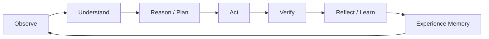
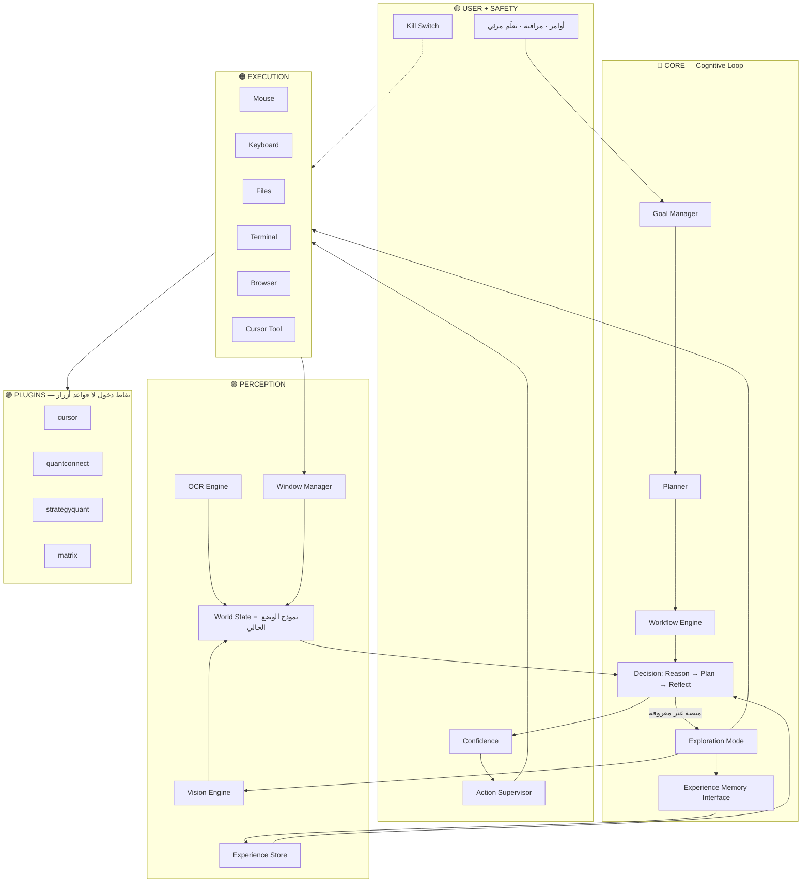

# APOS v1.1 — Architecture (مرجع رسمي محدّث)

**Personal Autonomous Operations Platform**  
فلسفة: لا نعرّف كل منصة مسبقاً — النظام **يتعلّمها** بالملاحظة والتجربة والحفظ.

> v1.0 كان صحيحاً كطبقات.  
> v1.1 يصحّح القلب: من «Profiles جاهزة» → **Experience + Exploration**.  
> لا نعيد تسمية المشروع الآن (Atlas/Cortex لاحقاً). الأولوية: بناء يعمل.

---

## قرار مباشر: هل نحتاج مخططاً جديداً بالكامل؟

| | |
|--|--|
| **نعم نحدّث المرجع** | لأن الفلسفة تغيّرت (تعلّم لا قواعد أزرار) |
| **لا نرمي الطبقات** | Core / Perception / Execution / Plugins تبقى |
| **لا نبدأ V2.0 أسطوري قبل كود** | World Model الكامل + Curiosity + Research ذاتي = مراحل لاحقة |

---

## الحلقة المعرفية (قلب النظام)



هذه الحلقة **داخل** Decision Engine — ليست بديلاً عن الطبقات الأربع.

---

## المعمارية v1.1



---

## ماذا يعني World State في v1.1 (عملي وليس خيال)

ليس «عقل يفهم الكون». هو **صورة موحّدة للوضع الآن**:

- النوافذ المفتوحة وعناوينها
- النافذة النشطة
- الهدف الحالي وخطوة الـ Workflow
- آخر إجراء ونتيجته
- هل المنصة «مجهولة» أم لديها خبرات سابقة

هذا يغذّي التفكير. الصورة الخام وحدها لا تكفي.

---

## Experience بدل Platform Profiles الجامدة

| Profiles القديمة (مرفوضة كأساس) | Experience (معتمدة) |
|----------------------------------|---------------------|
| أنت تكتب أماكن الأزرار مسبقاً | النظام يستكشف أول مرة |
| قواعد ثابتة «إن X فـ Y» | فرضية → تجربة → نجاح/فشل → حفظ |
| ينكسر عند تغيّر الواجهة | يعيد الاستكشاف عند فشل الخبرة |

**Plugins** تبقى: مجرد هوية مسار (اسم نافذة متوقعة، مجلد تقارير، workflow id) — **بدون** قائمة أزرار يدوية إلزامية.

---

## Exploration Mode (مهم — ليس وكيل أسطوري منفصل في اليوم 1)

عند منصة جديدة أو ثقة منخفضة:

1. Observe (نافذة + لقطة عند الحاجة)  
2. Understand (قوائم / نصوص OCR)  
3. فرضية (أين Run؟)  
4. جرّب بحذر أمام المستخدم  
5. Verify  
6. احفظ في Experience Store ما نجح/فشل  

**Curiosity / Research Agent / Self-Improvement العميق** = v1.2+ (stubs في المجلدات فقط إن رغبت).

---

## هيكل المجلدات v1.1

```
APOS/
  core/
    orchestrator.py
    planner.py
    workflow_engine.py
    decision.py          # Reason → Act → Reflect
    exploration.py       # Exploration Mode
    memory/
      interface.py
      json_store.py
  perception/
    windows.py
    vision.py
    ocr.py
    world_state.py       # Unified / World State
  execution/
    mouse.py
    keyboard.py
    files.py
    terminal.py
    browser.py
    cursor_tool.py
    supervisor.py
  plugins/               # دخول خفيف — لا أزرار ثابتة
    cursor/
    quantconnect/
    strategyquant/
    matrix/
  experience/            # يملؤه النظام تلقائياً
  workflows/
    matrix_cycle.yaml
  ui/
  data/logs/
  docs/
```

---

## Recommended Implementations (قابلة للاستبدال)

| مجرد | تنفيذ أول |
|------|-----------|
| LLM Engine | Ollama (خفيف لـ 4GB VRAM) |
| Vision | لقطة عند حدث + نموذج رؤية صغير / OCR |
| Input | PyAutoGUI |
| Windows | pygetwindow / Win32 |
| Experience Store | JSON أولاً |

---

## ترتيب البناء (لا يتغيّر بسبب الفلسفة)

1. هيكل + World State + Experience Memory  
2. UI + Kill Switch + Mouse/Keyboard + Supervisor  
3. Decision loop بسيط + Exploration Mode  
4. Vision حدثي + Ollama  
5. Workflow `matrix_cycle` + plugins دخول  
6. لاحقاً: Curiosity / Research / Vector / تحسين ذاتي

---

## مرفوض في v1.1

- إعادة تسمية المشروع الآن وإيقاف البناء
- لقطة كل ثانية كوضع افتراضي
- برمجة يدوية لكل أزرار 15 منصة
- Anthropic Computer Use كأساس
- عقل على Forex VPS (4GB)
