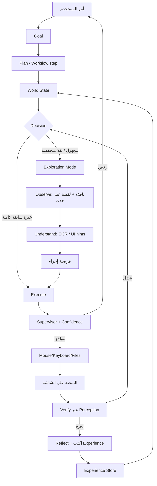
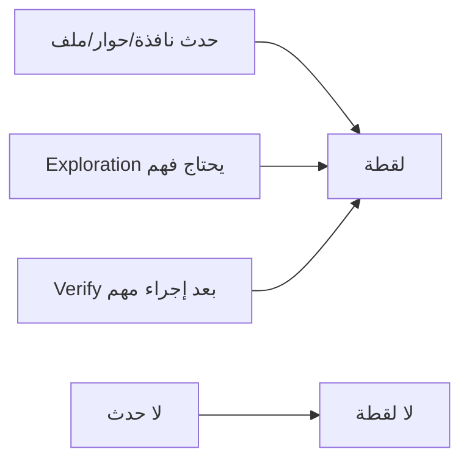

# APOS v1.1 — Data Flow (تعلّم + إدراك)

---

## التدفق المعرفي



---

## متى تُلتقط الشاشة؟



---

## Experience Record (مثال شكل البيانات)

```json
{
  "platform_hint": "strategyquant",
  "window_title_pattern": "StrategyQuant",
  "tried": [
    {"action": "click_text:Start", "result": "fail", "note": "no change"},
    {"action": "click_text:Run", "result": "success", "note": "progress bar appeared"}
  ],
  "best": {"action": "click_text:Run", "confidence": 0.82},
  "updated_at": "ISO-8601"
}
```

النظام يكتب هذا — المستخدم لا يملأ إحداثيات مسبقاً.
