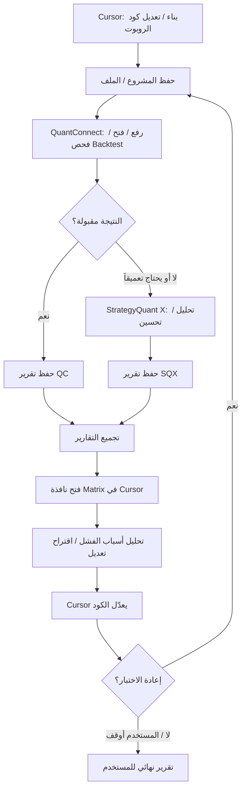

# APOS v1.1 — Workflow Diagram (Matrix)

مرجع وكيل التداول / دورة فحص روبوت الماتريكس.

كل مشروع = نافذة/مسار مستقل. هذه الدورة تخص **Matrix Robot** فقط.

---

## دورة Matrix المعتمدة



---

## تمثيل Workflow Engine (ملف)

`workflows/matrix_cycle.yaml` — منطق الدورة هنا، لا داخل كود الوكلاء مباشرة.

```yaml
id: matrix_cycle
name: Matrix Robot Validation Loop
owner: user_guided
steps:
  - id: build
    plugin: cursor
    mission: coding
    action: edit_or_build_robot
  - id: save
    plugin: matrix
    action: export_or_locate_files
  - id: qc_test
    plugin: quantconnect
    action: open_run_backtest_collect_report
  - id: decide_qc
    core: decision
    on_fail: sqx_analyze
    on_pass: assemble_reports
  - id: sqx_analyze
    plugin: strategyquant
    action: analyze_export_report
    optional: true
  - id: assemble_reports
    core: files
    action: collect_reports
  - id: matrix_review
    plugin: cursor
    mission: matrix
    action: open_matrix_window_attach_reports
  - id: patch
    plugin: cursor
    action: apply_code_changes
  - id: loop_or_stop
    core: decision
    ask_user_if_confidence_low: true
```

---

## قواعد خاصة بهذه الدورة

1. QuantConnect و StrategyQuant = مصادر بيانات/فحص — **ليسا** من يقرران الاستراتيجية النهائية وحدهما.
2. التحليل النهائي وتعديل الكود = في Cursor / نافذة Matrix أمام المستخدم.
3. أي تداول حقيقي أو حذف أو تحويل أموال = Confirmation Box إلزامي.
4. المستخدم يرى الماوس ويمكنه Kill Switch في أي خطوة.
5. إن فشل إيجاد عنصر: Exploration Mode + Vision عند الحدث → إن بقيت الثقة منخفضة → اسأل المستخدم → احفظ النتيجة في Experience Store (وليس ملف أزرار يدوي).

---

## Workflows لاحقاً (لا تُبنَى في v1)

- dropshipping_cycle
- social_media_cycle
- app_dev_cycle

تُضاف كملفات YAML جديدة تحت `workflows/` دون تغيير Core.
